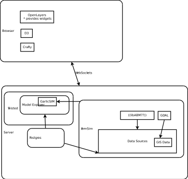

## Model
????????

The model is probably not parallelizable. Subparts of it may be--and depending on what the model is written in some parts might nicely parallelize and others might be impossibly serial
* [[Modelling]]

## Frontend

  The frontend should appear to be an attractive video game, but one where graphs and data can be brought up at a moments' notice. We're ambitiously attempting to gamify science.

The frontend does:
* render layered maps (_[openlayers](http://ol3js.org/)_)
  * allow the user to choose what layers they are looking at (to some degree; we don't want to overwhelm)
  * allows interaction with the map. OpenLayers provides [widgets](http://ol3js.org/en/master/apidoc/ol.control.html) and "[interactions](http://ol3js.org/en/master/apidoc/ol.interaction.html)" which we can extend and patch upstream as needed
* allow comparison of 'any' (upper bounded by cognitive load) user-chosen set of variables (_[D3](http://d3js.org)_)
  * this means plots, with a way to mouseover something and export numbers
  * 1d and 2d distributions with confidence indicated
  * If we can work out a way to sensibly show 4d data, that would be cool
* render flow diagrams for aiding causation tracking
* at a low enough zoom level, renders agents from one of the simulations running in the backend
* also the frontend must be responsive, on the order of 10ms (**todo: tcstewart's citation**) 

See also [[Visualizations]] for in-depth details about the rainbow of ways to render data at our beck and call.

The frontend should be graphics and network-bound; it should not be doing any numerical computations itself.


## Backend

 Probably Python/Scipy
 GDAL (for geographic data)
 [http://repast.sourceforge.net/](Repast)?
 If it is useful, build the db on Postgres with the PostGIS extension

   current plan is to build an app in python using [Twisted](http://twistedmatrix.com/trac/) which hosts [[GarlicSIM]] models, and handles recording data

 The backend is a Twisted server hosting some static content and a bunch of dynamic endpoints. ((should we go for a RESTful situation or try to use Autobahn?)). Layout is:

* ```/assets```
  * ```/assets/images``` -- sprites, art
  * ```/assets/maps```   -- GIS datasets ((do we really want to expose these literally here?))
  * ```/assets/data```   -- more typical tabular data
  * ```/assets/libs```   -- external frontend dependencies, like d3 and ol3
* ```/maps```
  * ```/maps/raster```
    * index is a json listing of available rasters
    * ```/maps/raster/<rastername>/z/x/y.png``` -- a (potentially dynamically drawn) bitmap of the map at tile coordinates (x,y,z) on layer ```rastername```. some of these rasters are typical mappy maps, most are fields like rainfall amounts or pollutant concentration or albedo
  * ```/maps/vector```
    * index is a json listing of available vectors
    * each vector might actually be dynamic!
    * ((how do we handle only asking for regional subsets of vectors?))
* ```/data/indicators```  -- websockets giving streams of data for plotting
  * ```/data/indicators/carbon/```
  * ```/data/indicators/happiness```
* ```/control``` 

((in all this we haven't talked at all about sessioning: how do we let users choose to either collab or to start their own simulation instance))

### Model Explorer
  A major component for us is a tool at some remove from the nitty details of the rest of the system for exploring models in general. This wiki is in the "modex" repository right now, reflecting the importance of this tool. It might also be called the Simulation Host, which in an [IoC](http://en.wikipedia.org/wiki/Inversion_of_control) way, loads and collects results from simulation runs. It should be able to easily record, slice and visualize any aspect of the simulation. The closest work we have in mind is tcstewar's [ccmsuite](https://github.com/tcstewar/ccmsuite) and (the unmaintained) [GarlicSim](https://github.com/cool-RR/GarlicSim) (in fact we might just take up maintenance GarlicSim). Also, for the sake of getting other research groups interesting, using, and eating our own dogfood, the simulation host should be as platform agnostic as possible.

Model Explorer's duties are:
 * load models
 * batch run lots of copies of a model
   * clearly distinguish and provide hooks for handling deterministic models sampled at different initial conditions, nondeterministic models sampled several times at the same initial conditions, and mixtures
 * provide a consistent data API (similar to how Repast collects several timestepping and geographic APIs in one place)
 * provide a consistent data logging API
 * generate plots
 * generate statistics, all using the bootstrap method so we can get accurate (ie nonparametric) values
  * estimates
  * probability densities
  * condidence intervals
  * **And** plots of these where relevant (eg estimated temperature on a map, estimated sensitivity field across a state space plot)

It seems like [[GarlicSIM]] does much of this already, but it's unmaintained. We need to investigate it.

The backend should be designed to be CPU-bound, not disk, network, or memory-bound. So, it should exploit parallelization as much as it can and liberally cache states.

**Aspects** is a key word here, as even a simple five-object model has 5 objects each of which could have some arbitrary number of variables of interest (weight, tempurature, wealth, happiness, ...) and 5-choose-2=10 pairs which means that any relationship of interest has 10 series that need tracking, and all of this is potentially recorded over time. We need to have a tight way to record this information, and a tighter way to reduce it to useful slices.
   ([ccmsuite](http://github.com/tcstewar/ccmsuite), or whatever develops to replace it)

### Importing (csv, shapefile, graphviz)
  [[Datasets]]

### Exporting (csv, graphs)


 