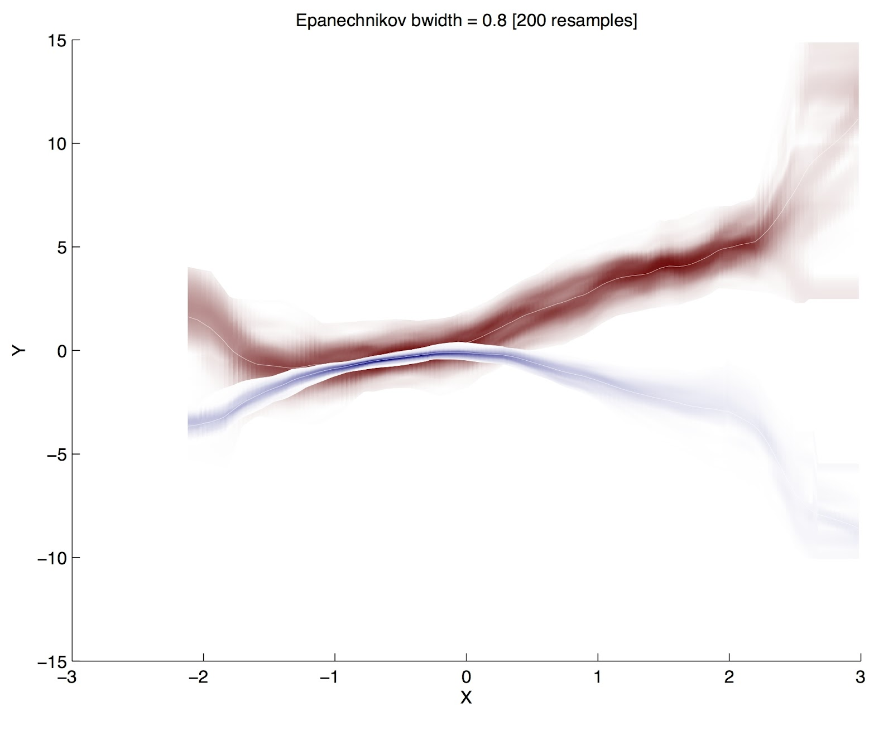
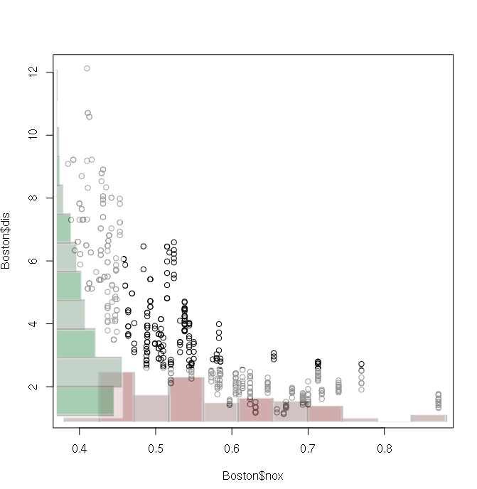

(todo: as we figure out the sorts of visualizations)
(check out [Datasets](Datasets.md) to get a feel for the **type** of visualizations we need)

For this to be any use, this tool desperately must limit the cognitive burden on the user. That means easy-to-learn, attractive maps and plots with details-on-demand, and probably information reduction.

### Zooming

We've been throwing around an idea about adaptive-zoom a lot. In short, we want different scales to be rendered qualitatively differently.

Audacity, the famous and free audio editor, does exactly this (see [TrackArtist::DrawClipWaveform](http://code.google.com/p/audacity/source/browse/audacity-src/trunk/src/TrackArtist.cpp#1379)): when you zoom out you see the range (min to max) overlaid with the RMS energy in different colours computed across a window, and when you zoom in you see individual samples.

In our case, when you zoom out to the further scale we would like to show world maps overlaid with the various metrics (carbon, soil, air, wealth) the user asks for, mapped with their uncertainty (where those values and uncertainty are computed across several model instances running in parallel), while at the medium scales we want to show renderings of some of the data in aggregate--for example, render tree sprites in areas of forest--and at the finest scales we should pick an individual model and display what it is up to, complete with agents animated and walking around (and maybe the tree sprites can stick around, but enlarged).

## Uncertainty 
In our [Modelling](Modelling.md), we care deeply about compuing estimates of the uncertainty in our models (e.g. confidence intervals or credible intervals) (which we can do, see [Modelling](Modelling.md) for details on that, if that section has been written yet, which it probably hasn't if this comment is still here -nick).

We have been calling these "salience plots" but you can't google that. There is some example code to do it in R and Matlab by Solomon Hsiang at [his blog](http://www.fight-entropy.com/2012/08/watercolor-regression.html). It seems like very few have seriously thought about this before, beyond including error bars, and there is simply no standard terminology for it, though Solomon 
[is attempting to change that](http://www.fight-entropy.com/2012/07/visually-weighted-regression.html).

(But a _**warning**_: make sure to actually use an estimator that provides densities, not confidence intervals. CIs are not defined to produce estimates of where it is certain that something is.)

Here's an example of a timeseries plot with uncertainty listed as a heatmap 
And here's the "Watercolor Regression" demo from Solomon 

## Model Structure

* [PathVisio](https://github.com/wikipathways/pathvisiojs/) - _visualizes biological signalling pathways, which are very, very, very complicated and part of several complex systems_ (sorta sketchy tho; [more demos](http://wikipathways.org/index.php/Pathway:WP2516))

## Tabular

* Bar Charts
* Stacked bar charts
* Line graphs
* Stacked Line graphs
* [Bullet Charts](http://bl.ocks.org/mbostock/4061961)
* [Correlation Explorer](https://github.com/CompassInc/correlation-explorer) (the name is poorly chosen; it's basically a visualization of a spreadsheet. compare: imshow() in matlab)
* Marimekko/Cascade/Mosaic/[Eikosograms](https://www.youtube.com/watch?v=9ZuYfZukBcM)

Can we do this? Histograms with 1-d scatter plots overlaid (forgive the ugly photoshop mockup):

## Timeseries

This is a special special case of the previous: special enough to warrant separate attention.

## Categorical

http://dimplejs.org/examples_viewer.html?id=bars_matrix

* Venn Diagrams
* Treemaps/Packed Circles (also a sort of network visualization)

## High dimension tabular

* Radar charts (like in DDR)
* Coxcombs Charts (aka Polar Area Charts) -- very similar to radar charts, in that the vertical (and therefore linear) distance of a slice of a circle is used to display an element of a data point; the same idea has been used by sailors and meterologists for 700 years in "Wind Rose Charts". Has the advantage that, if the slices are not enough categorization, categories can be stacked outward in each slice 
* Parallel coordinate plots
* [NavGraph](http://navgraph.com/) (local!)
* [Scagnostics](http://cran.r-project.org/web/packages/scagnostics/) - _more similar to model checking, but based on visualization ideas_

## Cartographic

 ---we need to handle zooming smoothly, going from different types, and as we do this we need maintain context for the user. googlemaps does this by fading out layers as more detailed tiles are loaded-in

## Algorithmic

Plotting 
There's no reason that plotting needs to plot _data_. It can also plot _algorithms_.

* [Floyd's Algorithm in d3](http://www.jasondavies.com/duplicates/)

## Network

(idea: check out Sheelagh Carpendale's transmogrification and Visits work)

### Trees

Trees are special cases of networks: they have no cycles; often you designate one node the "root". have 

Root-centric visualizations

* [egonetwork pandemic visualization](http://rocs.hu-berlin.de/projects/hidden/index.html)
* [dendrograms](http://bl.ocks.org/mbostock/2429963)
* 

## Inspiration
* http://visual.ly
* http://visualizing.org/
* http://flowingdata.com/
* http://popchartlab.com/
* http://eagereyes.org/techniques/graphs-hairball
* http://insightmaker.com/
* http://store.axismaps.co.uk/
* [ManyEyes](http://www-958.ibm.com/software/analytics/manyeyes/)
* anything on [/r/dataisbeautiful](http://www.reddit.com/r/dataisbeautiful/)
* http://graphicdesign.stackexchange.com/questions/15788/examples-of-well-designed-software-architecture-diagrams
* The use of d3 + javascript + and html5 slider widget on [this page](http://scott.fortmann-roe.com/docs/BiasVariance.html) is glorious
* [xkcd clock-world](http://xkcd.com/now)
